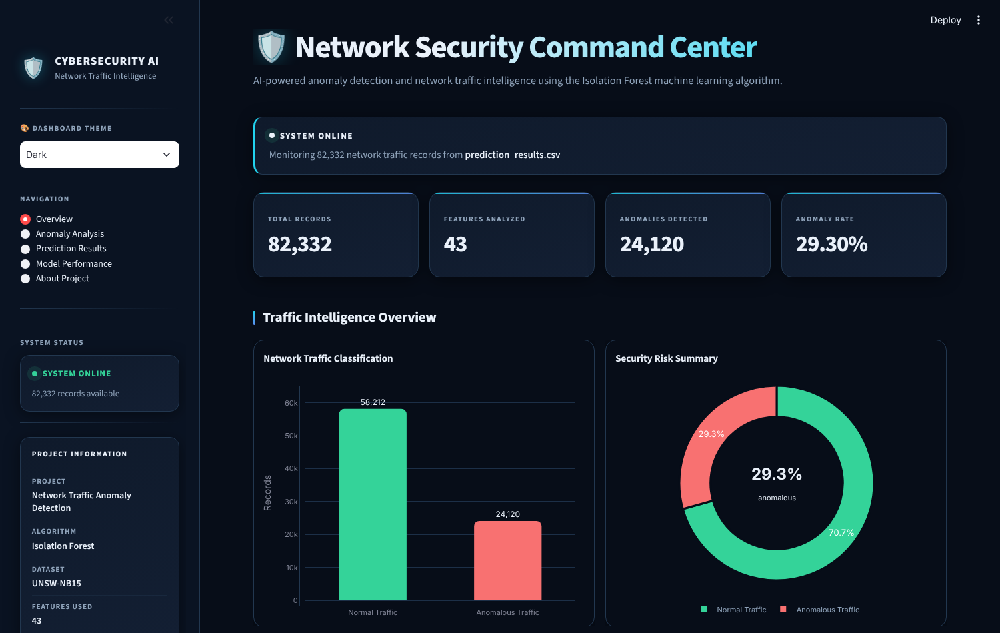
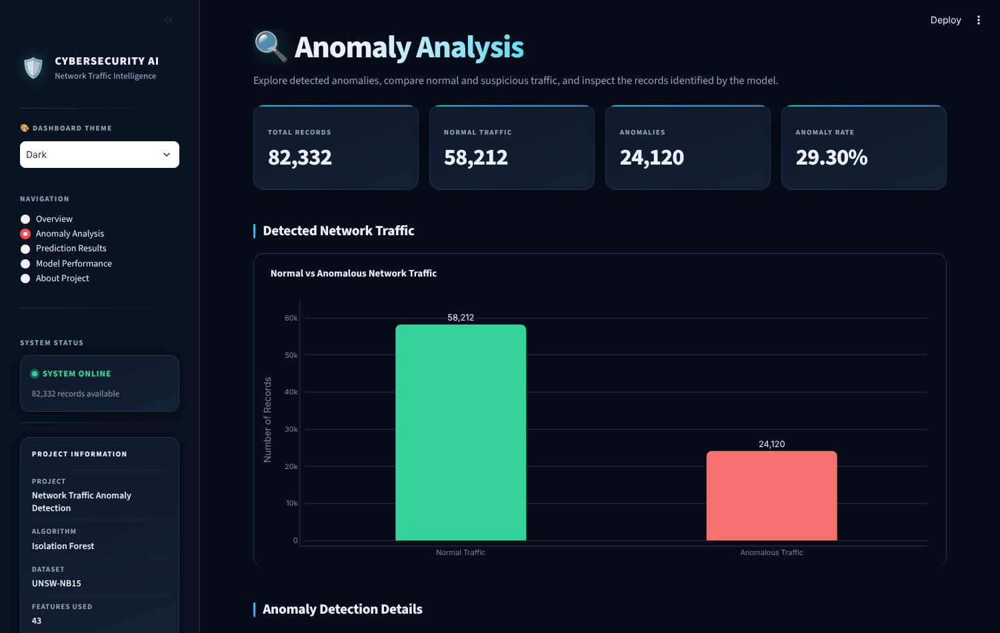
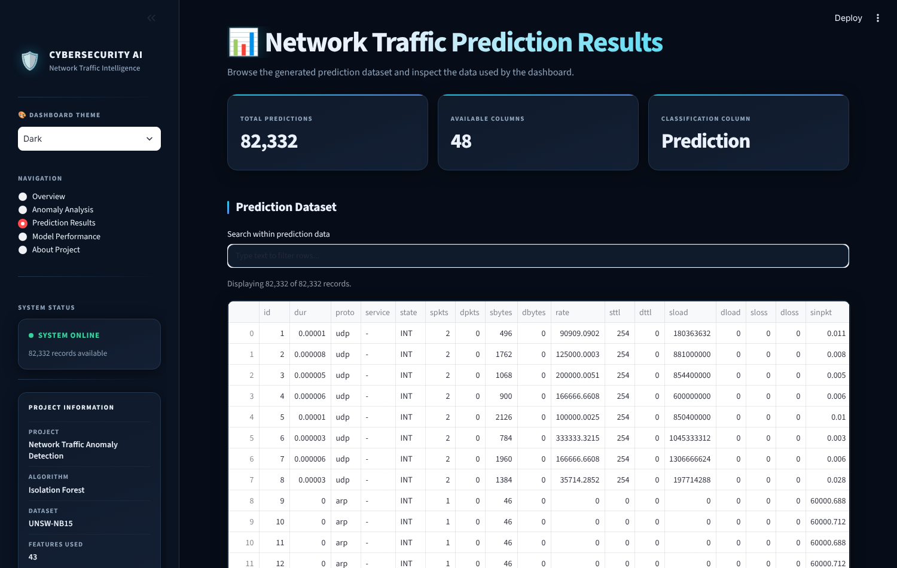

# Network Traffic Anomaly Detection

A machine learning project that detects unusual network traffic in the public UNSW-NB15 dataset, stores the results in a SQL database, and presents them in an interactive security dashboard.

Built with Python, scikit-learn, SQL (SQLite) and Streamlit.



## What it does

- Scores network flow records with an Isolation Forest model trained on normal traffic
- Classifies each record as normal or anomalous
- Loads the results into SQLite for SQL-based analysis
- Provides a dashboard to explore anomalies, predictions and model output

## Results

| Measure | Value |
|---|---|
| Records analysed (UNSW-NB15 testing set) | 82,332 |
| Features used | 43 |
| Records flagged as anomalous | 24,120 (29.30%) |
| Records classified as normal | 58,212 |

Isolation Forest is an unsupervised method, so these figures describe what the model flagged. They are not accuracy, precision or recall scores.

## How it works

```text
UNSW-NB15 records  →  Feature alignment and scaling  →  Isolation Forest  →  SQLite  →  Dashboard
```

| File | Purpose |
|---|---|
| `Src/predict.py` | Loads the trained model and scaler, aligns the features and scores the testing set |
| `setup_database.py` | Loads the prediction results into a SQLite database |
| `sql_queries.py` | SQL analysis: record counts, anomaly rate and traffic breakdowns |
| `Dashboard/app.py` | Streamlit dashboard |
| `Outputs/` | Trained Isolation Forest model and feature scaler |

## Dashboard

| Anomaly analysis | Prediction results |
|---|---|
|  |  |

The dashboard has five pages: Overview, Anomaly Analysis, Prediction Results, Model Performance and About Project, with light and dark themes.

## Dataset

This project uses the public UNSW-NB15 network traffic dataset from UNSW Canberra. The raw CSV files and the large generated outputs are not stored in this repository because of their size.

1. Download `UNSW_NB15_training-set.csv` and `UNSW_NB15_testing-set.csv` from the UNSW-NB15 dataset page.
2. Place both files in `Data/Raw/`.

## Run it locally

```bash
git clone https://github.com/OmerNaeemKhan/Network-Traffic-Anomaly-Detection.git
cd Network-Traffic-Anomaly-Detection

python -m venv .venv
.venv\Scripts\activate          # Windows
# source .venv/bin/activate     # macOS / Linux

pip install -r requirements.txt

python Src/predict.py           # scores the testing set
python setup_database.py        # builds the SQLite database
python sql_queries.py           # runs the SQL analysis
streamlit run Dashboard/app.py  # opens the dashboard
```

The trained model and scaler are included in `Outputs/`, so no training step is needed.

## Skills demonstrated

Python · pandas · NumPy · scikit-learn · unsupervised anomaly detection · SQL · SQLite · Streamlit · Plotly · Altair

## Author

**Omer Naeem Khan** — Data Analyst
[GitHub](https://github.com/OmerNaeemKhan) · [LinkedIn](https://www.linkedin.com/in/omer-khan-03833749)
